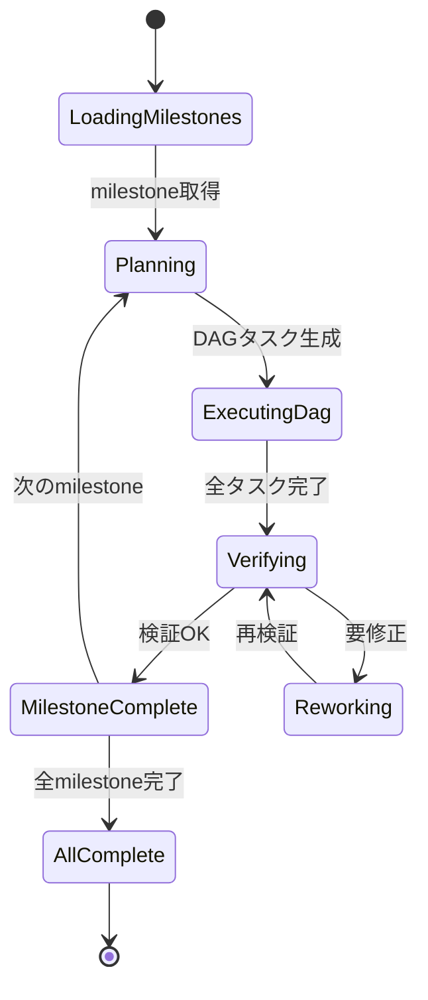

# Architecture & Design Patterns

## 1. モジュール依存関係グラフ

### 1.1 全モジュール構成（11パッケージ）

```
ymdvsymd/whirlwind (root)  ※ npm は @ymdvsymd/whirlwind v0.3.1
  types          (基本型定義、no import)
  util           (-> json)
  config         (-> types, util, json)
  cli            (-> types, config)
  display        (-> json)
  prompts        (no import)
  agent          (-> types, json)
  review         (-> types, agent, prompts, util)
  ralph          (-> types, agent, config, prompts, util, json)
  plan           (-> types, util, json)
  cmd/helpers    (-> json)
  cmd/app        (is-main: true)
    imports: types, config, cli, agent, ralph, plan, cmd/helpers, sys, json
```

### 1.2 外部依存関係

| パッケージ | バージョン | 役割 | 使用モジュール |
|-----------|-----------|------|--------------|
| `moonbitlang/x` | 0.4.40 | ユーティリティ | sys (CLI引数取得) |

---

## 2. レイヤーアーキテクチャ

```
Layer 0: 基盤型・ユーティリティ
  types (他の全モジュールに依存される)
  util (-> json)

Layer 1: 設定・UIパーツ・プロンプト
  config (-> types, util, json)
  cli (-> types, config)
  display (-> json)
  prompts (独立)

Layer 2: エージェント実装
  agent (-> types, json)
  review (-> types, agent, prompts, util)

Layer 3: オーケストレーション
  ralph (-> types, agent, config, prompts, util, json)
  plan (-> types, util, json)

Layer 4: CLI・エントリーポイント
  cmd/helpers (-> json)
  cmd/app (-> types, config, cli, agent, ralph, cmd/helpers, sys, json)
```

### 各レイヤーの責務

| Layer | 責務 | 典型的な変更理由 |
|-------|------|----------------|
| 0 (types/util) | ドメイン型の定義・汎用ユーティリティ | 新概念の追加 |
| 1 (config/cli/display/prompts) | 入出力・設定管理・プロンプト | 新設定項目、表示形式 |
| 2 (agent/review) | AI実行・品質検証 | 新バックエンド、レビュー観点 |
| 3 (ralph) | ワークフロー制御 | 新実行モード、フェーズ |
| 4 (cmd/app) | エントリーポイント・FFI | CLI引数、JS統合 |

---

## 3. FFI境界（MoonBit <-> JavaScript）

### 3.1 FFI設計原則

- MoonBit側: 高レベルの宣言的API
- JavaScript側: 低レベルのNode.js操作

### 3.2 FFIファイル一覧

| ファイル | 役割 |
|---------|------|
| `src/cmd/app/ffi_js.mbt` | ファイルI/O、stdin、環境変数、sleep |
| `src/agent/sdk_js.mbt` | Claude/Codex SDK 実行 |

### 3.3 主要FFI関数

| 関数 | 役割 | JS実装 |
|------|------|--------|
| `js_read_file_sync` | ファイル読込 | `fs.readFileSync()` |
| `js_write_file_sync` | ファイル書込 | `fs.writeFileSync()` |
| `js_prompt_sync` | stdin入力 | readline subprocess |
| `js_exec_sync` | シェルコマンド | `execSync()` |
| `js_run_sdk` | SDK実行 | `spawnSync(runner.mjs)` |
| `js_start_stdin_watcher` | stdin監視開始 | stdin-watcher.mjs 起動 |
| `js_check_interrupt` | 割り込み確認 | `.whirlwind/interrupt.txt` |
| `js_sleep_ms` | スリープ | `SharedArrayBuffer + Atomics.wait` |
| `js_get_env` | 環境変数 | `process.env[]` |
| `js_now_timestamp` | 時刻取得 | `new Date()` |

---

## 4. 設計パターン

### 4.1 Traitベース多態性 (AgentBackend)

```moonbit
pub(open) trait AgentBackend {
  run(Self, task, system_prompt, on_output) -> AgentResult
  name(Self) -> String
  set_session_id(Self, String) -> Unit
  get_session_id(Self) -> String
}
```

3つの実装:
- `SubprocessBackend` (claude-code/codex) - SDK経由プロセス実行
- `MockBackend` - テスト用

動的ディスパッチ:
```moonbit
pub struct BoxedBackend { inner: &AgentBackend }
```

### 4.2 ファクトリパターン

```moonbit
pub fn create_backend(config: AgentConfig) -> BoxedBackend {
  match config.kind {
    ClaudeCode => SubprocessBackend::new(ClaudeCode, ...).boxed()
    Codex => SubprocessBackend::new(Codex, ...).boxed()
    Mock => MockBackend::new().boxed()
  }
}
```

### 4.3 イベント駆動 + コールバック

```moonbit
pub enum OrchestratorEvent {
  AgentOutput(AgentOutputEvent)
  AgentComplete(AgentCompleteEvent)
  TaskStart(TaskStartEvent)
  TaskComplete(TaskCompleteEvent)
  TaskAssign(TaskAssignEvent)
  ReviewStart(ReviewStartEvent)
  ReviewComplete(ReviewCompleteEvent)
  PhaseChange(PhaseChangeEvent)
  SessionComplete(SessionCompleteEvent)
  Info(InfoEvent)
}

pub struct OrchestratorCallbacks {
  on_event: (OrchestratorEvent) -> Unit
  on_save: () -> Unit
}
```

### 4.4 ステートマシン

**Ralph Loop — `run_ralph()`:**



### 4.5 代数的データ型による型安全性

```moonbit
// 状態の網羅的パターンマッチング
match task.status {
  Pending => ()
  InProgress(agent_id) => run_task(task, agent_id)
  Done => complete(task)
  Failed(err) => handle_error(task, err)
}
```

### 4.6 ストリーミングイベントモデル

```moonbit
pub enum AgentEvent {
  OutputLine(String)
  Info(String)
  ToolCall(name~, input~)
  ToolResult(name~, output~)
  SubAgentStart(agent_type~, task~)
  SubAgentEnd(agent_type~)
  StatusChange(AgentStatus)
  SessionId(String)
  Usage(input_tokens~, output_tokens~, cache_read~, cache_write~, cost_usd~)
}
```

処理フロー:
```
LLM Provider -> StreamHandler -> OutputLineBuffer -> AgentEvent
  -> on_output callback -> Orchestrator callback -> TUI/ログ更新
```

---

## 5. データフロー

### 5.1 設定 -> 実行

```
CLI args -> parse_cli_args() -> CliCommand
  -> config_path / plan_path / flags
  -> ProjectConfig::from_json_string()
  -> cli.apply_overrides()
  -> ProjectConfig::validate()
  -> agent.create_backends()
  -> RalphLoop 生成・実行
```

### 5.2 レビューフロー

```
ReviewAgent::review(task, backend)
  -> for perspective in [CodeQuality, Performance, Security]:
       build_prompt(perspective, task) -> backend.run()
       -> parse_verdict(output)
         -> <approved> | <needs_changes>items</needs_changes> | <rejected>
  -> merge verdicts (first Rejected wins, else merge NeedsChanges)
```

---

## 6. 拡張ポイント

| 拡張対象 | 変更箇所 |
|---------|---------|
| 新AgentKind | types.mbt + config.mbt + factory.mbt + 新Backend実装 |
| 新レビュー観点 | ReviewPerspective enum + review.mbt |
| 新Ralphフェーズ | RalphPhase enum + ralph_loop*.mbt (4ファイル構成) |

---

## 7. アーキテクチャ上の考慮点

### 7.1 cmd/app/main.mbt の集中

`main.mbt` は REPL ループ、セッション永続化、タスクビルダー、レビュー実行、
git コンテキスト収集を単一ファイルに含む。
将来的に `session/`, `context/`, `prompt_builder/` への分解が検討できる。
