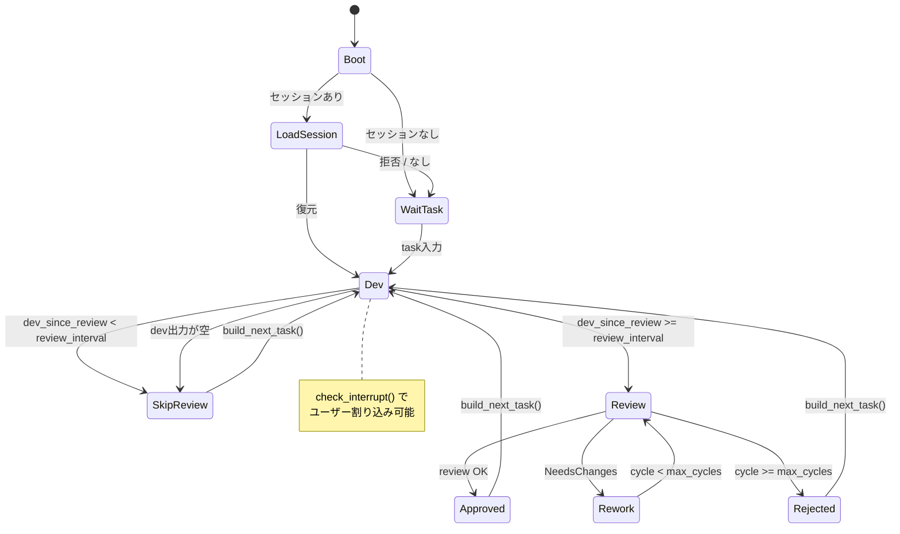
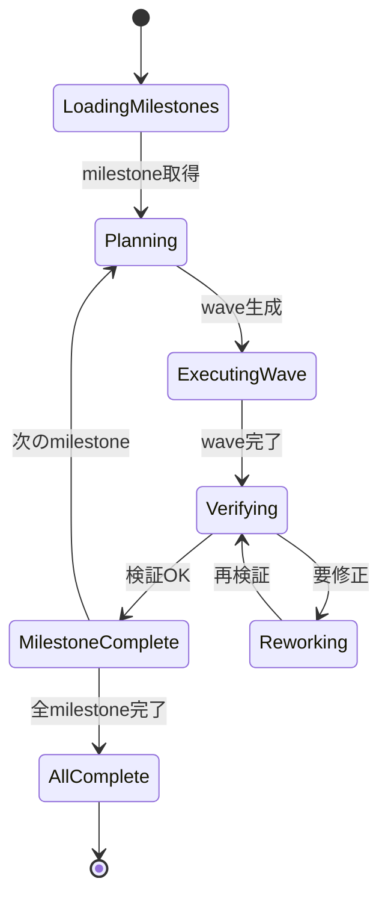
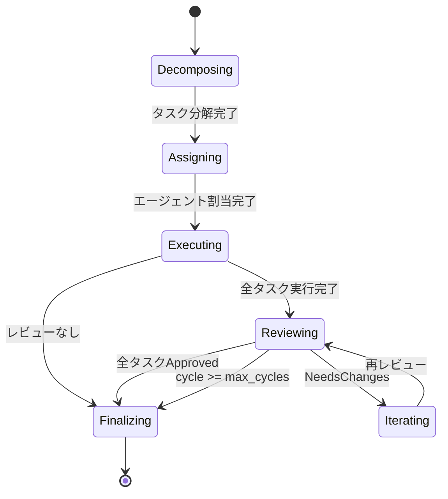

# Architecture & Design Patterns

## 1. モジュール依存関係グラフ

### 1.1 全モジュール構成（12パッケージ）

```
ymdvsymd/whirlwind (root)  ※ npm は @ymdvsymd/whirlwind v0.9.1
  types          (基本型定義、no import)
  config         (-> types)
  cli            (-> types, config)
  agent          (-> types, llm/*, json)
  review         (-> types, agent)
  orchestrator   (-> types, agent, task, review, config)
  task           (-> types)
  spawn          (no import)
  display        (-> json)
  ralph          (-> types, agent, config, json)
  tui            (-> types, tui/vnode)
  cmd/app        (is-main: true)
    imports: types, config, cli, agent, review, display, ralph, sys, json
```

### 1.2 外部依存関係

| パッケージ | バージョン | 役割 | 使用モジュール |
|-----------|-----------|------|--------------|
| `mizchi/llm` | 0.2.2 | LLM提供者抽象化 | anthropic, openai, ffi |
| `mizchi/x` | 0.1.3 | ユーティリティ | sys (CLI引数取得) |
| `mizchi/tui` | 0.7.0 | TUI描画エンジン | vnode (VNodeコンポーネント) |

---

## 2. レイヤーアーキテクチャ

```
Layer 0: types (基盤型層)
  他の全モジュールに依存される

Layer 1: 設定・タスク・UIパーツ
  config (-> types)
  task (-> types)
  display (-> json)
  spawn (独立)

Layer 2: エージェント実装
  agent (-> types, llm/*)
  review (-> types, agent)

Layer 3: オーケストレーション
  orchestrator (-> types, agent, task, review, config)
  ralph (-> types, agent, config, json)

Layer 4: CLI・エントリーポイント
  cmd/app (-> types, config, cli, agent, review, display, ralph, sys)
```

### 各レイヤーの責務

| Layer | 責務 | 典型的な変更理由 |
|-------|------|----------------|
| 0 (types) | ドメイン型の定義・共有 | 新概念の追加 |
| 1 (config/task/display) | 入出力・設定管理 | 新設定項目、表示形式 |
| 2 (agent/review) | AI実行・品質検証 | 新バックエンド、レビュー観点 |
| 3 (orchestrator/ralph) | ワークフロー制御 | 新実行モード、フェーズ |
| 4 (cmd/app) | エントリーポイント・FFI | CLI引数、JS統合 |

---

## 3. FFI境界（MoonBit <-> JavaScript）

### 3.1 FFI設計原則

- MoonBit側: 高レベルの宣言的API
- JavaScript側: 低レベルのNode.js操作

### 3.2 FFIファイル一覧

| ファイル | 関数数 | 役割 |
|---------|--------|------|
| `src/cmd/app/ffi_js.mbt` | 10 | ファイルI/O、stdin、環境変数、sleep |
| `src/agent/sdk_js.mbt` | 1 | Claude/Codex SDK 実行 |
| `src/spawn/ffi_js.mbt` | 1 | ストリーミングプロセス起動 |

### 3.3 主要FFI関数

| 関数 | 役割 | JS実装 |
|------|------|--------|
| `js_read_file_sync` | ファイル読込 | `fs.readFileSync()` |
| `js_write_file_sync` | ファイル書込 | `fs.writeFileSync()` |
| `js_prompt_sync` | stdin入力 | readline subprocess |
| `js_exec_sync` | シェルコマンド | `execSync()` |
| `js_run_sdk` | SDK実行 | `spawnSync(runner.mjs)` |
| `js_start_stdin_watcher` | stdin監視開始 | stdin-watcher.mjs 起動 |
| `js_check_interrupt` | 割り込み確認 | `.whirlwind/interrupt.txt` |
| `js_sleep_ms` | スリープ | `SharedArrayBuffer + Atomics.wait` |
| `js_get_env` | 環境変数 | `process.env[]` |
| `js_now_timestamp` | 時刻取得 | `new Date()` |

---

## 4. 設計パターン

### 4.1 Traitベース多態性 (AgentBackend)

```moonbit
pub(open) trait AgentBackend {
  run(Self, task, system_prompt, on_output) -> AgentResult
  name(Self) -> String
  set_session_id(Self, String) -> Unit
  get_session_id(Self) -> String
}
```

3つの実装:
- `SubprocessBackend` (claude-code/codex) - SDK経由プロセス実行
- `ApiBackend` (Anthropic/OpenAI) - API直接呼出
- `MockBackend` - テスト用

動的ディスパッチ:
```moonbit
pub struct BoxedBackend { inner: &AgentBackend }
```

### 4.2 ファクトリパターン

```moonbit
pub fn create_backend(config: AgentConfig) -> BoxedBackend {
  match config.kind {
    ClaudeCode => SubprocessBackend::new(ClaudeCode, ...).boxed()
    Codex => SubprocessBackend::new(Codex, ...).boxed()
    Api => ApiBackend::anthropic(api_key, ...).boxed()
    Mock => MockBackend::new().boxed()
  }
}
```

### 4.3 イベント駆動 + コールバック

```moonbit
pub struct OrchestratorCallbacks {
  on_agent_output: (String, String) -> Unit
  on_agent_complete: (String, String) -> Unit
  on_task_start: (String, String, String) -> Unit
  on_task_complete: (String, String) -> Unit
  on_task_assign: (String, String) -> Unit
  on_review_start: (String, String) -> Unit
  on_review_complete: (String, ReviewVerdict) -> Unit
  on_phase_change: (String, OrchestratorPhase) -> Unit
  on_session_complete: (String) -> Unit
  on_info: (String) -> Unit
}
```

### 4.4 ステートマシン

**通常モード (Heartbeat Loop) — `run_repl()`:**



**Ralph Loop — `run_ralph()`:**



**Orchestrator モード — `Orchestrator::run()` (未使用):**



> **Note:** `Orchestrator::run()` は現在どのエントリーポイントからも呼ばれていない。
> `run_repl()` / `run_ralph()` とは独立した3つ目のオーケストレーション設計である。

### 4.5 代数的データ型による型安全性

```moonbit
// 状態の網羅的パターンマッチング
match task.status {
  Pending => ()
  InProgress(agent_id) => run_task(task, agent_id)
  Done => complete(task)
  Failed(err) => handle_error(task, err)
}
```

### 4.6 ストリーミングイベントモデル

```moonbit
pub enum AgentEvent {
  OutputLine(String)
  Info(String)
  ToolCall(name~, input~)
  ToolResult(name~, output~)
  SubAgentStart(agent_type~, task~)
  SubAgentEnd(agent_type~)
  StatusChange(AgentStatus)
  SessionId(String)
  Usage(input_tokens~, output_tokens~, cache_read~, cache_write~, cost_usd~)
}
```

処理フロー:
```
LLM Provider -> StreamHandler -> OutputLineBuffer -> AgentEvent
  -> on_output callback -> Orchestrator callback -> TUI/ログ更新
```

---

## 5. データフロー

### 5.1 設定 -> 実行

```
CLI args -> parse_cli_args() -> CliCommand
  -> config_path / plan_path / flags
  -> ProjectConfig::from_json_string()
  -> cli.apply_overrides()
  -> ProjectConfig::validate()
  -> agent.create_backends()
  -> if ralph: RalphLoop 生成
     else:     run_repl() (while true ループ)
```

### 5.2 タスク実行 (通常モード)

```
run_repl() の while true ループ:
  -> run_dev(dev_id, task)
       backend.run(prompt, system_prompt, on_output)
       -> AgentResult { content, status, error }
  -> if review_interval 未達: build_next_task() -> continue
  -> run_review(task, dev_output)
       -> Approved:  build_next_task() -> continue
       -> Rejected:  check_interrupt() でユーザー入力待ち
```

> **Note:** `Orchestrator::execute_tasks()` は `orchestrator.mbt` に定義されているが、
> 実際のランタイムでは `run_repl()` が `run_dev()` / `run_review()` を直接呼んでいる。

### 5.3 レビューフロー

```
ReviewAgent::review(task, backend)
  -> for perspective in [CodeQuality, Performance, Security]:
       build_prompt(perspective, task) -> backend.run()
       -> parse_verdict(output)
         -> <approved> | <needs_changes>items</needs_changes> | <rejected>
  -> merge verdicts (first Rejected wins, else merge NeedsChanges)
```

---

## 6. 拡張ポイント

| 拡張対象 | 変更箇所 |
|---------|---------|
| 新AgentKind | types.mbt + config.mbt + factory.mbt + 新Backend実装 |
| 新レビュー観点 | ReviewPerspective enum + review.mbt |
| 新Ralphフェーズ | RalphPhase enum + ralph_loop.mbt |
| 新LLMプロバイダ | mizchi/llm に実装追加 (ApiBackend自動対応) |
| 新UI画面 | views.mbt + state.mbt |

---

## 7. アーキテクチャ上の考慮点

### 7.1 cmd/app/main.mbt の集中

`main.mbt` は約1,380行で、REPL ループ、セッション永続化、タスクビルダー、レビュー実行、
git コンテキスト収集を単一ファイルに含む。`run_repl()` 関数だけで約400行。
将来的に `session/`, `context/`, `prompt_builder/` への分解が検討できる。

### 7.2 spawn/ モジュールの未使用

`src/spawn/` の非同期 `spawn_streaming` インフラは他モジュールからインポートされていない。
エージェントシステムは `sdk_js.mbt` の同期 `spawnSync` を使用。
将来的な非同期実行（Wave 並列化等）のための基盤として残されている。

### 7.3 orchestrator/ と ralph/ の重複

両モジュールがタスク実行とリワークループを異なるアプローチで実装:
- `orchestrator/`: `TaskManager` + `ReviewAgent`（3観点レビュー）
- `ralph/`: `MilestoneManager` + `VerifierAgent`（マイルストーン単位4観点並列検証, v0.9.0）

実行・リワークのプリミティブを共有する余地がある。
