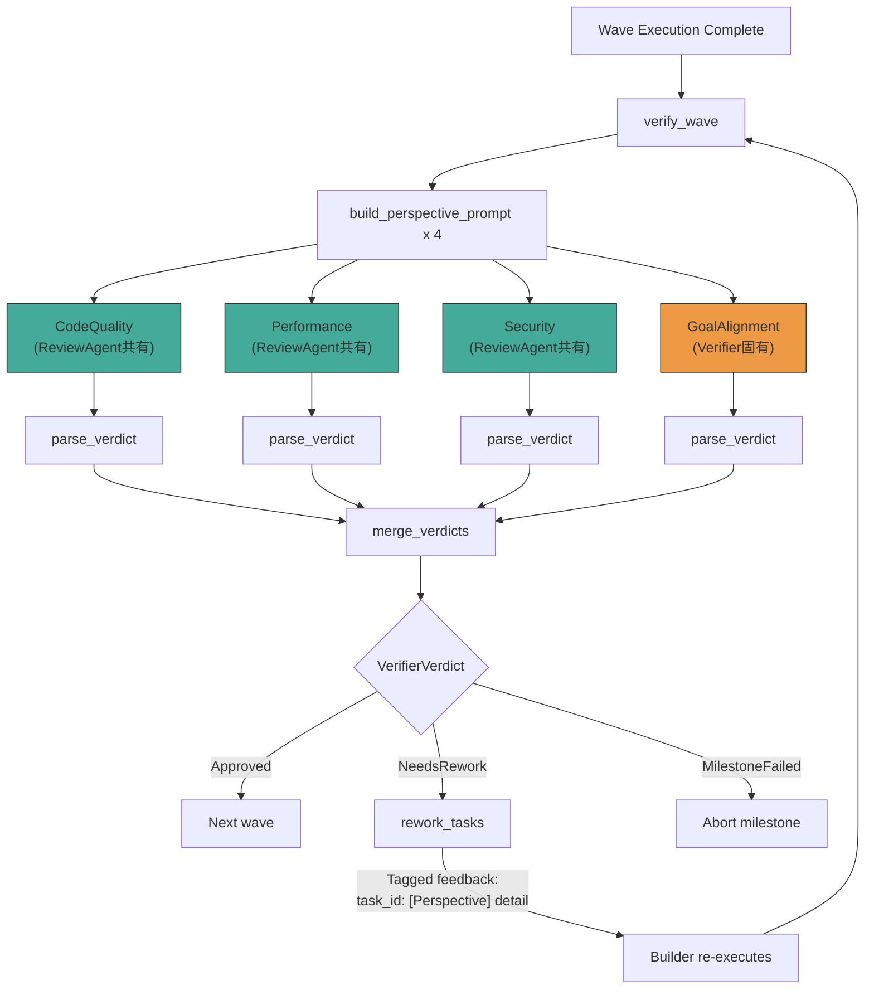

# 1. Verifier 4観点並列検証

Date: 2026-03-20

Owner: ymdvsymd

## Status

Superseded by Option 2 (see Decision section)

## Context

Ralph モードの VerifierAgent は、Wave 完了後にコード品質を検証する役割を担う。現在の実装（`src/ralph/verifier.mbt` の `build_verify_prompt()`）では、以下の汎用プロンプトを使用している:

> "Check code quality, correctness, and alignment with the milestone goal"

一方、通常モードの ReviewAgent（`src/review/review.mbt`）は、3つの明示的な観点（CodeQuality / Performance / Security）ごとに専用プロンプトを構築し、それぞれ個別に LLM を呼び出す構造化された評価を実施している。

### 現状比較

| Item | ReviewAgent (normal mode) | VerifierAgent (Ralph mode) |
|------|---------------------------|---------------------------|
| LLM calls | 3 per task | 1 per wave |
| Perspective separation | Explicit (dedicated prompt per perspective) | None (generic prompt) |
| Feedback tags | `[CodeQuality]`, `[Performance]`, `[Security]` | None |
| Scope | Single task | Entire wave (milestone-aware) |

### 問題

VerifierAgent の汎用プロンプトでは、LLM が暗黙的に品質チェックの観点を選択するため、以下のリスクがある:

- **観点の欠落**: Security や Performance が一切チェックされないケースがある
- **フィードバックの曖昧さ**: `rework_tasks()` が受け取るフィードバックに観点情報がなく、Builder が修正の優先度を判断しにくい
- **再現性の低下**: 同じコードに対する検証結果がプロンプトの解釈に依存して変動する

## Decision

### 選択肢

3つのアプローチを検討した:

| Approach | LLM calls | Cost | Perspective coverage |
|----------|-----------|------|---------------------|
| Status quo (generic single prompt) | 1 per wave | 1x | Implicit |
| Option 1: Prompt enhancement | 1 per wave | 1x | Explicit (single prompt) |
| **Option 2: 4観点並列検証 (adopted)** | **4 per wave (parallel)** | **4x（並列実行により実時間は ≈1x）** | **Maximum** |

### 不採用: Option 1 — プロンプト強化

1回の LLM 呼び出しの中で3観点を明示的に指示するアプローチ。コスト増なしで観点カバレッジの改善を期待したが、以下の問題が判明した:

- **タグ出現率の不確実性**: 単一プロンプトで複数観点のタグ出力を指示しても、LLM が全観点を網羅する保証がない。構造的にカバレッジを担保できない
- **コード再利用の欠如**: ReviewAgent が既に持つ観点別プロンプト構築ロジックを活用できず、チェック項目の二重管理が発生する

### 採用: Option 2 — 4観点並列検証

4つの LLM 呼び出しを観点（CodeQuality / Performance / Security / GoalAlignment）ごとに**並列実行**する。

- ReviewAgent の観点別プロンプト構築（CodeQuality / Performance / Security）を再利用し、チェック項目の一元管理を実現
- **GoalAlignment** は VerifierAgent 固有の観点として新設。マイルストーン目標との整合性を独立してチェックする
- 結果マージ後に VerifierVerdict（Approved / NeedsRework / MilestoneFailed）を決定
- コスト4倍だが、並列実行により実行時間の増加は抑制される

### 実装方針

#### 1. 並列実行基盤

- `parallel-runner.mjs`: N 個の SDK 呼び出しを並列実行するラッパースクリプト
- `AgentBackend` に `run_parallel()` 相当の機能を追加
- 既存の `spawnSync` を外殻として使い、内部で `Promise.all` による並列化

#### 2. VerifierAgent の更新 (`src/ralph/verifier.mbt`)

- `VerifierPerspective` enum の追加（CodeQuality, Performance, Security, GoalAlignment）
- 観点別プロンプト構築（ReviewAgent の CodeQuality / Performance / Security プロンプトを再利用）
- GoalAlignment 固有のプロンプト（マイルストーン目標との整合性チェック）
- `verify()` を4並列呼び出し + マージに変更
- `merge_verdicts()`: MilestoneFailed は即時失敗、NeedsRework は全観点から累積、全 Approved で通過

#### 3. ReviewAgent の並列化 (`src/review/review.mbt`)

- `review()` の3観点逐次ループを並列実行に変更
- マージロジックは既存のまま（Rejected で即時停止、NeedsChanges を累積）

#### 4. 既存コードへの影響

- `rework_tasks()`（`src/ralph/ralph_loop.mbt`）は変更不要。観点タグ `[Security]` 等はフィードバック文字列の一部として埋め込まれ、`strip_task_feedback_prefix()` は `task_id:` プレフィックスのみを除去し、残りのテキスト（タグ含む）をそのまま Builder に渡す
- `parse_verdict()` は変更不要。観点ごとの出力を個別にパースする

#### 5. テスト追加 (`src/ralph/verifier_test.mbt`)

- 観点タグ付きフィードバックの `parse_verdict()` テスト
- `merge_verdicts()` のテスト（全 Approved / 一部 NeedsRework / MilestoneFailed の各ケース）
- 複数観点が混在するフィードバックの分割テスト

### アーキテクチャ変更

## Consequences

### 改善される点

- **観点カバレッジの構造的保証**: 観点ごとに独立した LLM 呼び出しにより、タグ出現率の問題が解消される。全観点が必ずチェックされる
- **コード再利用**: ReviewAgent の観点別プロンプト構築ロジックを共有し、チェック項目の一元管理が可能になる
- **GoalAlignment の独立化**: マイルストーン目標との整合性チェックが独立した観点として明示化され、評価の透明性が向上する
- **並列実行**: 4つの LLM 呼び出しを並列起動するため、コスト4倍に対して実行時間の増加は最小限に抑制される
- **フィードバックの構造化**: `[Perspective]` タグにより Builder が修正の種別を認識でき、的確な修正が期待できる
- **後方互換性**: `rework_tasks()` と `strip_task_feedback_prefix()` は変更不要

### リスクと対策

| Risk | Mitigation |
| ------ | ----------- |
| コスト4倍 | 並列実行で実時間は抑制。観点カバレッジの構造的保証とのトレードオフとして許容 |
| 並列実行基盤の追加複雑性 | `parallel-runner.mjs` は既存パターン（`spawnSync` + ラッパー）の延長。`Promise.all` による標準的な並列化 |
| GoalAlignment の評価基準の曖昧さ | マイルストーン goal テキストに基づく明確な指示プロンプトで対処。評価基準を具体的に定義 |
| Perspective tag format may conflict with task output | Tags use bracket format `[X]` distinct from XML tags used for verdict parsing |
